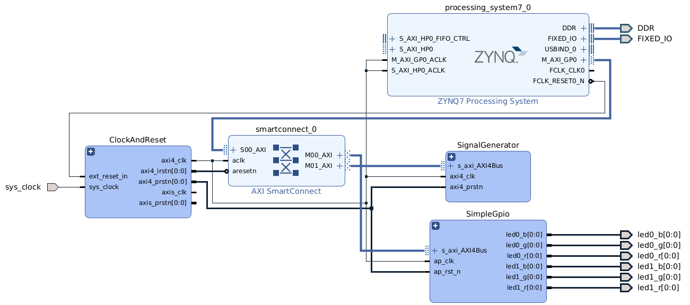

# HLSCrashCourse
This project demonstrates the HLS cores from the core itself, adding the core to a Vivado project, and using the core in petalinux.

# Required Tools for Firmware (Vivado) compilation
* Xilinx Vivado 2022.1
* Xilinx Vitis HLS 2022.1
* Petalinux 2022.1

A docker configuration is available at https://github.com/jsloan256/xilinx-docker (2022.1 branch).

# Hardware
## Target
* [Digilent CoraZ7-07S](https://reference.digilentinc.com/programmable-logic/cora-z7/start?redirect=1)

# Vivado project
## Restoring the Vivado project
Perform the following steps to regenerate the Vivado top-level project as well as any Vivado HLS IP core projects. Vivado project restoration is not required for Matlab simulation.

* Change to the Scripts folder in project directory (ie. /HLSCrashCourse/Scripts)
* Run: `Scripts$ ./RestoreAll.sh`

## Building the Vivado project from the command line
* Run: `Scripts$ ./GenerateXSA.sh`

## Building the Vivado project in the GUI
* Open Vivado/HLSCrashCourse.xpr in Vivado 2022.1
* Run **Generate Bitstream** from the Vivado Flow Navigator window pane
* Run `source Scripts/ExportXSA.tcl` from the Vivado TCL window

# Firmware Block Diagram

## SimpleGpio Hierarchy Block Diagram

## SignalGenerator Hierarchy Block Diagram

# Building Linux
After generating the bitstream and exporting the XSA in Vivado:

* Run: `Scripts$ ./BuildLinux.sh`

## Install Linux to SD card
Verify that JP2 is installed. Connect the SD card to your PC and find its mount point (often /dev/sda, /dev/sdb, etc.) **BE CAREFUL, THE FOLLOWING COMMANDS WILL WIPE YOUR HARDDRIVE IF YOU SPECIFY THE WRONG /dev/sdX location.**

Run
* `HCCLinux$ ../Scripts/PartitionSDCard /dev/sdX`
* Remove and reinstall SD card into PC
* `HCCLinux$ ../Scripts/ProgramSDCard /dev/sdX`

Open a serial terminal and log into linux using `petalinux` as the username.

# Debugging applications in Vitis SDK
* `Scripts$ ./CreateSDK.sh`
* `Scripts$ ./CreateWorkspace.sh`
* `$ vitis -workspace VitisWorkspace`
